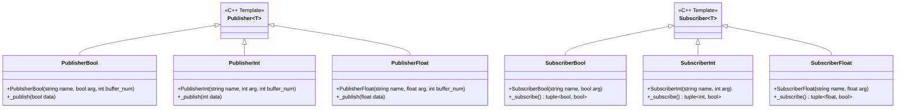

# 📋 SHM Technical Specification - Complete System Architecture Documentation
[English | [日本語](docs_jp/md_manual_spec_jp.html)]

\tableofcontents

# 🎯 Purpose

The purpose of SHM (Shared-memory based Handy-communication Manager) is to provide the most secure and fastest possible communication between different processes. It is also designed with careful consideration to make it easy for students to use. Please refer to README.md for installation instructions.

# 📖 Abstract

## Framework Context

The Instrumentation and Robotics Laboratory at Utsunomiya University uses shared memory for data exchange between programs, in addition to local memory generally used by programs.

Shared memory differs from local memory in several key aspects:
- **Memory Management**: Developers must not release allocated memory (inadvertent release prevents data passing to other programs)
- **Programming Complexity**: Higher barrier for novice programmers due to pointer usage
- **Development Overhead**: Designers must create custom processes for each memory type when creating new libraries

This framework **hides data exchange using shared memory** and provides **easy-to-understand inter-process communication** for novice programmers.

## 🚀 System Functions

### Memory Management Process Hiding
Easy inter-process communication is achieved by hiding shared memory area allocation and buffer access within classes. By default, only **standard layout type classes** are supported. Other classes can be supported by defining specialized Publishers/Subscribers for each case. See samples for details.

### Pointer-Free Coding
The system fundamentally only requires passing variables allocated in local memory to Publishers or receiving topics from Subscribers, **eliminating the need to code with shared memory pointers** as in traditional approaches.

## 👥 User Characteristics

### 🎓 Developer
Developers create new programs using internal and external libraries, including this library. Primarily intended for **first-time programming students** such as fourth-year undergraduates.

### 🏗️ Designer  
Designers create new libraries using this framework and transfer current know-how to junior members. Primarily intended for **second-year master students**.

## 📚 Definitions and Terms

### Local Memory
Local memory is a **virtual storage area accessible within a process**. It's the storage area used during normal programming. If not properly released after use, it may cause future problems (programs working correctly for a while may suddenly stop).

### Shared Memory
Shared memory is a **storage area that can be used commonly among processes**. It's allocated by special means and can be implemented in various ways. This implementation uses **POSIX file-mapped memory**, where data stored in shared memory is treated as a file. In Linux, the allocated memory area can be confirmed directly under `/dev/shm`.

### Standard Layout Type
A class or structure that:
- Contains no specific C++ language features (like virtual functions) not found in C
- Has all members with the same access control
- Enables `memcpy` operations
- Has clearly defined layout for use in C programs

**Standard layout types have the following characteristics:**
- No virtual functions or virtual base classes
- All non-static data members have the same access control
- All non-static members of class type are standard layout
- All base classes have standard layout
- No base class of the same type as the first non-static data member
- Meets one of the following conditions:
  - The most derived class has no non-static data members and only one base class with non-static data members
  - No base class contains non-static data members

# 🏗️ Architecture Design

## Overall System Architecture


## Layer Architecture

```mermaid
graph TB
    subgraph "Application Layer"
        APP[User Application]
    end
    
    subgraph "SHM API Layer"
        PUB[Publisher<T>]
        SUB[Subscriber<T>]
    end
    
    subgraph "Shared Memory Management Layer"
        SHM[SharedMemory]
        POSIX[SharedMemoryPosix]
        RB[RingBuffer]
    end
    
    subgraph "OS Layer"
        KERNEL[Linux Kernel]
        SHMFS[/dev/shm Filesystem]
    end
    
    APP --> PUB
    APP --> SUB
    PUB --> SHM
    SUB --> SHM
    SHM --> POSIX
    POSIX --> RB
    POSIX --> KERNEL
    KERNEL --> SHMFS
```

# 🔧 Detailed Design

## Class Hierarchy Structure


## Shared Memory Layout

```mermaid
graph TB
    subgraph "Shared Memory Segment"
        subgraph "Metadata Area"
            MUTEX[pthread_mutex_t]
            COND[pthread_cond_t]
            ESIZE[element_size]
            BUFNUM[buffer_num]
        end
        
        subgraph "Timestamp Area"
            TS0[timestamp[0]]
            TS1[timestamp[1]]
            TS2[timestamp[2]]
            TSN[timestamp[n-1]]
        end
        
        subgraph "Data Area"
            DATA0[data_buffer[0]]
            DATA1[data_buffer[1]]
            DATA2[data_buffer[2]]
            DATAN[data_buffer[n-1]]
        end
    end
    
    MUTEX --> COND
    COND --> ESIZE
    ESIZE --> BUFNUM
    BUFNUM --> TS0
    TS0 --> TS1
    TS1 --> TS2
    TS2 --> TSN
    TSN --> DATA0
    DATA0 --> DATA1
    DATA1 --> DATA2
    DATA2 --> DATAN
```

## Data Flow

### Publish Process Flow


### Subscribe Process Flow


### waitFor Process Flow


# 📡 Communication Protocol

## Ring Buffer Algorithm

### Buffer Selection Algorithm


### Data Reading Algorithm


## Synchronization Mechanism

### Mutex and Condition Variable


# ⚡ Performance Characteristics

## Memory Usage

Shared memory segment size is calculated by the following formula:

```
total_size = metadata_size + timestamp_array_size + data_array_size

metadata_size = sizeof(pthread_mutex_t) + sizeof(pthread_cond_t) + 
                sizeof(size_t) + sizeof(size_t)

timestamp_array_size = sizeof(uint64_t) * buffer_num

data_array_size = element_size * buffer_num
```

## Latency Characteristics

```mermaid
graph LR
    subgraph "Latency Components"
        A[Application Processing] --> B[Publisher Processing]
        B --> C[Mutex Acquisition]
        C --> D[Memory Copy]
        D --> E[Timestamp Update]
        E --> F[Signal Transmission]
        F --> G[Subscriber Processing]
        G --> H[Application Processing]
    end
    
    subgraph "Typical Times"
        T1[App: ~1μs]
        T2[Pub: ~2μs]
        T3[Mutex: ~0.5μs]
        T4[Copy: ~0.1μs]
        T5[Time: ~0.1μs]
        T6[Signal: ~0.5μs]
        T7[Sub: ~2μs]
        T8[App: ~1μs]
    end
```



# 🔒 Security Considerations

## Access Permissions


## Data Integrity


# ❌ Error Handling

## Error Classification and Response

```mermaid
flowchart TD
    Error([Error Occurred]) --> CheckType{Error Type}
    
    CheckType -->|Initialization Error| InitError[Initialization Error]
    CheckType -->|Communication Error| CommError[Communication Error]
    CheckType -->|Memory Error| MemError[Memory Error]
    CheckType -->|Timeout| TimeoutError[Timeout Error]
    
    InitError --> InitActions[・Name verification<br/>・Permission check<br/>・POD type verification]
    CommError --> CommActions[・Shared memory reconnection<br/>・Publisher side check<br/>・Process liveness check]
    MemError --> MemActions[・Memory shortage check<br/>・Segment deletion<br/>・System restart]
    TimeoutError --> TimeoutActions[・Timeout value adjustment<br/>・Publisher frequency check<br/>・System load check]
    
    InitActions --> LogError[Output error log]
    CommActions --> LogError
    MemActions --> LogError
    TimeoutActions --> LogError
    
    LogError --> Recovery{Recoverable?}
    Recovery -->|Yes| Retry[Retry process]
    Recovery -->|No| Abort[Abort process]
    
    Retry --> Success{Success?}
    Success -->|Yes| End([Normal termination])
    Success -->|No| Recovery
    Abort --> End
```



# 🐍 Python Binding Design

## Boost.Python Wrapper Structure



## Python/C++ Data Conversion

```mermaid
sequenceDiagram
    participant Py as Python App
    participant Boost as Boost.Python
    participant Wrapper as C++ Wrapper
    participant Core as SHM Core
    
    Note over Py,Core: Publish Process
    Py->>+Boost: pub.publish(data)
    Boost->>+Wrapper: _publish(converted_data)
    Note over Boost: Python type → C++ type conversion
    Wrapper->>+Core: publish(data)
    Core-->>-Wrapper: void
    Wrapper-->>-Boost: void
    Boost-->>-Py: None
    
    Note over Py,Core: Subscribe Process
    Py->>+Boost: data, success = sub.subscribe()
    Boost->>+Wrapper: _subscribe()
    Wrapper->>+Core: subscribe(&is_success)
    Core-->>-Wrapper: result_data
    Wrapper-->>-Boost: make_tuple(result_data, is_success)
    Note over Boost: C++ type → Python type conversion
    Boost-->>-Py: (data, success)
```



# 🔧 Extensibility Considerations

## Adding New Data Types

```mermaid
flowchart TD
    Start([Add new type T]) --> CheckPOD{POD type?}
    CheckPOD -->|Yes| UseTemplate[Use existing templates]
    CheckPOD -->|No| Specialize[Template specialization]
    
    UseTemplate --> InstantiateC[Instantiate Publisher<T>,<br/>Subscriber<T> in C++]
    Specialize --> CustomImpl[Custom implementation<br/>・Serialization<br/>・Deserialization]
    
    CustomImpl --> InstantiateC
    InstantiateC --> PythonNeeded{Python support needed?}
    
    PythonNeeded -->|Yes| CreateWrapper[Create Boost.Python wrapper<br/>・PublisherT<br/>・SubscriberT]
    PythonNeeded -->|No| TestC[Implement C++ tests]
    
    CreateWrapper --> UpdateModule[Add to BOOST_PYTHON_MODULE]
    UpdateModule --> TestPy[Implement Python tests]
    TestPy --> TestC
    TestC --> Document[Update documentation]
    Document --> End([Complete])
```



# 📚 References

## man shm_overview
The following URL provides an overview of POSIX shared memory:
<https://linuxjm.osdn.jp/html/LDP_man-pages/man7/shm_overview.7.html>

## Related Technical Specifications
- **POSIX.1-2001** Shared memory objects
- **POSIX.1-2001** pthread mutex and condition variables  
- **C++11** Standard layout types
- **Boost.Python 1.75+** Python bindings

## Additional Resources
- **Linux Kernel Documentation** - `/dev/shm` filesystem implementation
- **POSIX Real-time Extensions** - Inter-process synchronization
- **C++ Core Guidelines** - Memory safety and RAII patterns
- **Boost Documentation** - Python/C++ integration best practices

---

**📋 Technical Note**: This specification provides comprehensive documentation for the SHM library architecture, enabling developers and designers to understand, extend, and maintain the system effectively. For implementation examples, see the tutorial documentation.
