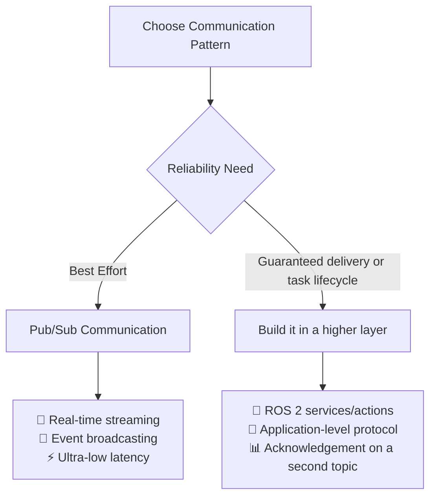

# 📝 C++ Tutorials - Master All Communication Patterns
[English | [日本語](docs_jp/md_manual_tutorials_jp.html)]

## 🎯 Learning Path Overview

This comprehensive tutorial series will take you from beginner to expert in shared memory communication. Each tutorial builds upon the previous ones, providing practical examples and real-world applications.

### 🏃‍♂️ Quick Navigation by Experience Level

| Level | Focus | Recommended Tutorials | Time Required |
|-------|-------|----------------------|---------------|
| 🥉 **Beginner** | Basic concepts and simple examples | Pub/Sub basics | 1-2 hours |
| 🥈 **Intermediate** | Error handling and performance | Advanced Pub/Sub features | 3-4 hours |
| 🥇 **Advanced** | Complex applications and optimization | Custom patterns on top of Pub/Sub | 5+ hours |

## 📚 Tutorial Series

### 🔄 Publisher/Subscriber Communication (Pub/Sub)
**Best for: Real-time data streaming, sensor networks, event broadcasting**

**[📖 Complete Pub/Sub Guide](tutorials_shm_pub_sub_en.md)**
- ⚡ **Ultra-low latency**: Microsecond-level communication
- 📡 **One-to-many broadcasting**: Multiple subscribers per publisher
- 🎯 **Zero-copy efficiency**: Direct memory access patterns
- 🛡️ **Thread-safe operations**: Concurrent publisher/subscriber handling

**Key Features:**
```cpp
// Simple yet powerful
Publisher<SensorData> sensor_pub("robot_sensors");
sensor_pub.publish(sensor_reading);  // Instant broadcast to all subscribers

Subscriber<SensorData> sensor_sub("robot_sensors");
bool success;
SensorData data = sensor_sub.subscribe(&success);
```

**Perfect for:**
- Robot sensor data streaming
- Real-time video/image processing
- High-frequency trading systems
- Live telemetry and monitoring

---

## 🎨 Communication Pattern Comparison

### When to Use Each Pattern


```mermaid
graph TD
    A[Choose Communication Pattern] --> B{Reliability Need}

    B -->|Best Effort| C[Pub/Sub Communication]
    B -->|Guaranteed delivery or task lifecycle| D[Build it in a higher layer]

    C --> E[📡 Real-time streaming<br/>🎯 Event broadcasting<br/>⚡ Ultra-low latency]
    D --> F[🤝 ROS 2 services/actions<br/>🔧 Application-level protocol<br/>📊 Acknowledgement on a second topic]
```

### Performance Characteristics

| Aspect | Pub/Sub |
|--------|---------|
| **Latency** | ~1μs |
| **Throughput** | Very High |
| **Reliability** | Best Effort |
| **Complexity** | Low |
| **Use Case** | Streaming |

## 🛠️ Getting Started

### Prerequisites
```bash
# System requirements
g++ --version      # GCC 7.0+ or equivalent
cmake --version    # CMake 3.10+
```

### Choose Your Starting Point

#### 🆕 New to Inter-Process Communication?
**Start here:** [🔄 Pub/Sub Tutorial](tutorials_shm_pub_sub_en.md)
- Learn fundamental concepts
- Simple API introduction
- Immediate results

#### 🔧 Need Reliable Communication?
This library only provides best-effort Pub/Sub. Request-response exchanges and
long-running task management (formerly `shm_service` / `shm_action`, removed in
v2.0.0) belong in a higher layer such as ROS 2 services and actions, or in an
application-level protocol built on top of Pub/Sub.

## 🎓 Learning Progression

### Phase 1: Foundation (🥉 Beginner)
1. **Understanding Concepts**: Read [📖 Introduction](introduction_en.md)
2. **Quick Experience**: Complete [🚀 Quick Start](quickstart_en.md)
3. **Basic Pub/Sub**: Master simple publisher/subscriber patterns

### Phase 2: Proficiency (🥈 Intermediate)
1. **Advanced Pub/Sub**: Multi-threaded publishing, custom data types
2. **Robust Applications**: Error handling, timeouts, retry logic
3. **Performance Optimization**: Benchmarking and tuning

### Phase 3: Mastery (🥇 Advanced)
1. **Custom Protocols**: Building domain-specific communication
3. **System Architecture**: Designing communication-heavy applications
4. **Performance Engineering**: Micro-optimization and profiling

## 🔗 Cross-References

### Related Topics
- **[🐍 Python Integration](tutorials_python_en.md)**: Use the same patterns in Python
- **[📋 API Reference](spec_en.md)**: Complete function documentation
- **[🐛 Troubleshooting](troubleshooting_en.md)**: Solve common problems
- **[📚 References](reference_en.md)**: Additional learning resources

### External Integration
- **ROS Integration**: Compatible with ROS message patterns
- **Multi-Language**: Seamless C++/Python interoperability
- **Cross-Platform**: Works on Linux, Windows (WSL), and macOS

## 💡 Success Tips

### 🎯 Best Practices
1. **Start Simple**: Begin with basic examples before complex scenarios
2. **Test Incrementally**: Verify each component before integration
3. **Monitor Performance**: Use built-in benchmarking tools
4. **Handle Errors**: Implement proper error checking from the start

### 🚨 Common Pitfalls to Avoid
1. **Topic Name Mismatches**: Ensure exact string matching
2. **Data Type Inconsistencies**: Use identical types across processes
3. **Resource Leaks**: Rely on RAII for automatic cleanup
4. **Blocking Operations**: Understand synchronous vs asynchronous patterns

---

**🚀 Ready to Begin?** Choose your first tutorial and start building lightning-fast inter-process communication systems! The power of microsecond-level communication awaits! ✨