# 📝 C++ Tutorials - Master All Communication Patterns
[English | [日本語](docs_jp/md_manual_tutorials_jp.html)]

## 🎯 Learning Path Overview

This comprehensive tutorial series will take you from beginner to expert in shared memory communication. Each tutorial builds upon the previous ones, providing practical examples and real-world applications.

### 🏃‍♂️ Quick Navigation by Experience Level

| Level | Focus | Recommended Tutorials | Time Required |
|-------|-------|----------------------|---------------|
| 🥉 **Beginner** | Basic concepts and simple examples | Pub/Sub basics → Service basics | 2-3 hours |
| 🥈 **Intermediate** | Error handling and performance | Advanced features in each pattern | 4-5 hours |
| 🥇 **Advanced** | Complex applications and optimization | Action communication + Custom patterns | 6+ hours |

## 📚 Tutorial Series

### 🔄 Publisher/Subscriber Communication (Pub/Sub)
**Best for: Real-time data streaming, sensor networks, event broadcasting**

**[📖 Complete Pub/Sub Guide](tutorials_shm_pub_sub_en.md)**
- ⚡ **Ultra-low latency**: Microsecond-level communication
- 📡 **One-to-many broadcasting**: Multiple subscribers per publisher
- 🎯 **Zero-copy efficiency**: Direct memory access patterns
- 🛡️ **Thread-safe operations**: Concurrent publisher/subscriber handling

**Key Features:**
```cpp
// Simple yet powerful
Publisher<SensorData> sensor_pub("robot_sensors");
sensor_pub.publish(sensor_reading);  // Instant broadcast to all subscribers

Subscriber<SensorData> sensor_sub("robot_sensors");
bool success;
SensorData data = sensor_sub.subscribe(&success);
```

**Perfect for:**
- Robot sensor data streaming
- Real-time video/image processing
- High-frequency trading systems
- Live telemetry and monitoring

---

### 🤝 Service Communication (Request-Response)
**Best for: Reliable data exchange, RPC-style communication, synchronous operations**

**[📖 Complete Service Guide](tutorials_shm_service_en.md)**
- 🔒 **Guaranteed delivery**: Request-response confirmation
- ⏱️ **Timeout management**: Configurable response timeouts
- 🔄 **Retry mechanisms**: Automatic failure recovery
- 🎯 **Type safety**: Compile-time request/response validation

**Key Features:**
```cpp
// Reliable request-response pattern
ServiceServer<CalculationRequest, CalculationResult> calc_server("calculator");
ServiceClient<CalculationRequest, CalculationResult> calc_client("calculator");

// Server processes requests reliably
if (calc_server.hasRequest()) {
    auto request = calc_server.getRequest();
    auto result = processCalculation(request);
    calc_server.sendResponse(result);
}

// Client gets guaranteed responses
calc_client.sendRequest(my_calculation);
if (calc_client.waitForResponse(5000000)) {  // 5 second timeout
    auto result = calc_client.getResponse();
    // Process guaranteed result
}
```

**Perfect for:**
- Database query operations
- File processing services
- Configuration management
- Calculation services

---

### ⚡ Action Communication (Long-Running Tasks)
**Best for: Asynchronous operations, progress monitoring, cancellable tasks**

**[📖 Complete Action Guide](tutorials_shm_action_en.md)**
- 🚀 **Non-blocking execution**: Asynchronous task processing
- 📊 **Progress feedback**: Real-time progress monitoring
- ❌ **Cancellation support**: Graceful task termination
- 🔄 **State management**: Comprehensive task lifecycle tracking

**Key Features:**
```cpp
// Advanced asynchronous processing
ActionServer<FileProcessingGoal, FileProcessingResult, FileProcessingFeedback> server("file_processor");
ActionClient<FileProcessingGoal, FileProcessingResult, FileProcessingFeedback> client("file_processor");

// Non-blocking goal submission
uint64_t goal_id = client.sendGoal(processing_goal);

// Monitor progress while doing other work
while (!client.isComplete(goal_id)) {
    FileProcessingFeedback feedback;
    if (client.getFeedback(goal_id, feedback)) {
        std::cout << "Progress: " << feedback.progress_percent << "%" << std::endl;
    }
    
    // Do other important work here...
    performOtherTasks();
    
    // Can cancel if needed
    if (shouldCancel()) {
        client.cancelGoal(goal_id);
        break;
    }
}
```

**Perfect for:**
- Large file processing
- Machine learning training
- Complex computations
- Long-running data transformations

## 🎨 Communication Pattern Comparison

### When to Use Each Pattern

```mermaid
graph TD
    A[Choose Communication Pattern] --> B{Data Size}
    B -->|Small, Frequent| C{Reliability Need}
    B -->|Large, Occasional| H[Action Communication]
    
    C -->|Best Effort| D[Pub/Sub Communication]
    C -->|Guaranteed| E{Processing Time}
    
    E -->|Quick Response| F[Service Communication]
    E -->|Long Running| G[Action Communication]
    
    D --> I[📡 Real-time streaming<br/>🎯 Event broadcasting<br/>⚡ Ultra-low latency]
    F --> J[🤝 Database queries<br/>🔧 Configuration<br/>📊 Quick calculations]
    G --> K[📁 File processing<br/>🧠 ML training<br/>⏳ Long computations]
    H --> K
```



### Performance Characteristics

| Aspect | Pub/Sub | Service | Action |
|--------|---------|---------|--------|
| **Latency** | ~1μs | ~2-5μs | ~2-10μs |
| **Throughput** | Very High | High | Medium |
| **Reliability** | Best Effort | Guaranteed | Guaranteed |
| **Complexity** | Low | Medium | High |
| **Use Case** | Streaming | RPC | Workflows |

## 🛠️ Getting Started

### Prerequisites
```bash
# System requirements
g++ --version      # GCC 7.0+ or equivalent
cmake --version    # CMake 3.10+
```

### Choose Your Starting Point

#### 🆕 New to Inter-Process Communication?
**Start here:** [🔄 Pub/Sub Tutorial](tutorials_shm_pub_sub_en.md)
- Learn fundamental concepts
- Simple API introduction
- Immediate results

#### 🔧 Need Reliable Communication?
**Start here:** [🤝 Service Tutorial](tutorials_shm_service_en.md)
- Request-response patterns
- Error handling strategies
- Production-ready examples

#### ⚡ Building Complex Systems?
**Start here:** [⚡ Action Tutorial](tutorials_shm_action_en.md)
- Advanced async patterns
- State management
- Enterprise-grade features

## 🎓 Learning Progression

### Phase 1: Foundation (🥉 Beginner)
1. **Understanding Concepts**: Read [📖 Introduction](introduction_en.md)
2. **Quick Experience**: Complete [🚀 Quick Start](quickstart_en.md)
3. **Basic Pub/Sub**: Master simple publisher/subscriber patterns
4. **Basic Service**: Learn request-response communication

### Phase 2: Proficiency (🥈 Intermediate)
1. **Advanced Pub/Sub**: Multi-threaded publishing, custom data types
2. **Robust Services**: Error handling, timeouts, retry logic
3. **Performance Optimization**: Benchmarking and tuning
4. **Integration Patterns**: Combining multiple communication types

### Phase 3: Mastery (🥇 Advanced)
1. **Action Communication**: Complex asynchronous workflows
2. **Custom Protocols**: Building domain-specific communication
3. **System Architecture**: Designing communication-heavy applications
4. **Performance Engineering**: Micro-optimization and profiling

## 🔗 Cross-References

### Related Topics
- **[🐍 Python Integration](tutorials_python_en.md)**: Use the same patterns in Python
- **[📋 API Reference](spec_en.md)**: Complete function documentation
- **[🐛 Troubleshooting](troubleshooting_en.md)**: Solve common problems
- **[📚 References](reference_en.md)**: Additional learning resources

### External Integration
- **ROS Integration**: Compatible with ROS message patterns
- **Multi-Language**: Seamless C++/Python interoperability
- **Cross-Platform**: Works on Linux, Windows (WSL), and macOS

## 💡 Success Tips

### 🎯 Best Practices
1. **Start Simple**: Begin with basic examples before complex scenarios
2. **Test Incrementally**: Verify each component before integration
3. **Monitor Performance**: Use built-in benchmarking tools
4. **Handle Errors**: Implement proper error checking from the start

### 🚨 Common Pitfalls to Avoid
1. **Topic Name Mismatches**: Ensure exact string matching
2. **Data Type Inconsistencies**: Use identical types across processes
3. **Resource Leaks**: Rely on RAII for automatic cleanup
4. **Blocking Operations**: Understand synchronous vs asynchronous patterns

---

**🚀 Ready to Begin?** Choose your first tutorial and start building lightning-fast inter-process communication systems! The power of microsecond-level communication awaits! ✨